# Тестовая работа
Первое задание храниться в папке "./task1"

Второе задание в папке "./B1_WEB".
Инструкция по настройке проекта находится в конце файла.

Для работы всех приложений надо настроить проект по примеру.

## Задание 1 (Python)
### Описание
Первое приложение состояло из пяти заданий

### 1. Сгенерировать 100 файлов, каждый из которых содержит 100 000 строк.
Для проверки данного задания необходимо запустить функцию "task1", которая
находиться в файле "./task1/main.py".

Результат выполнения:
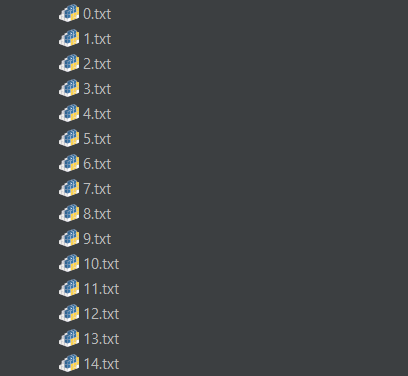
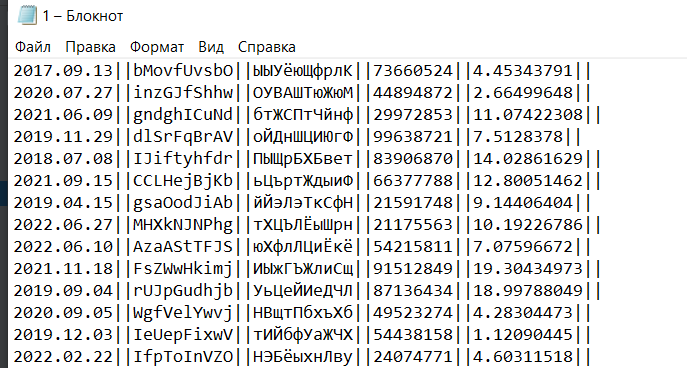


### 2. Объединение файлов в один с возможностью удаления строк.
Для проверки данного задания необходимо запустить функцию "task2", которая
находиться в файле "./task1/main.py".

Результат выполнения:
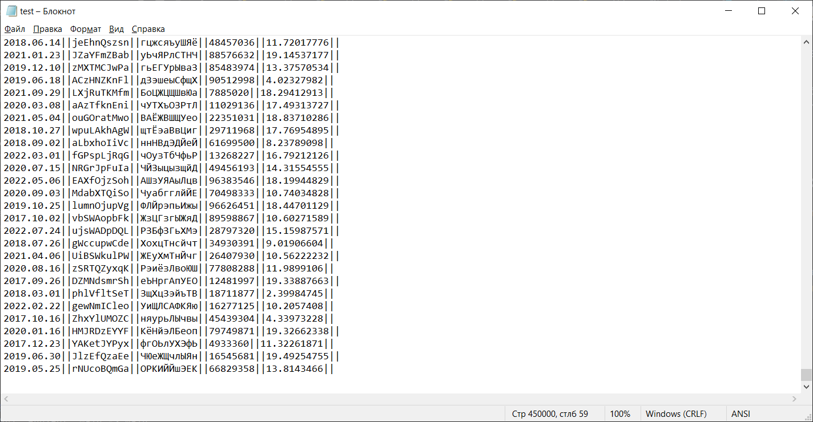


### 3. Импорт файлов в СУБД
Для проверки данного задания необходимо запустить функцию "task3", которая
находиться в файле "./task1/main.py".

Запись в бд и общение с ней осуществлялась с помощью библиотеки
sqlalchemy. Данные для подключения к бд прописаны в файле "./task1/db/config.py". 
Описание моделей находится в паке "./task1/db/models", общение
с бд в папке "./task1/db/repository".

Поля таблицы:
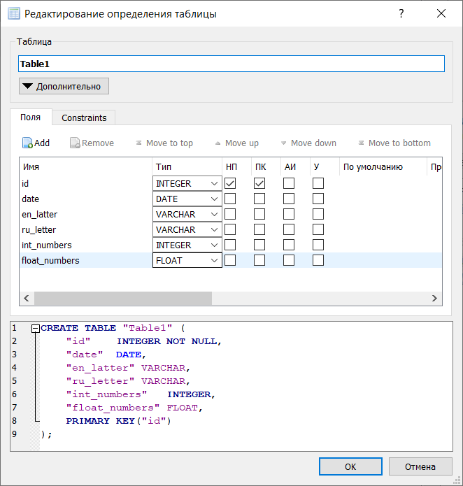

c
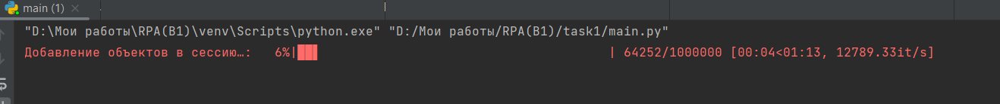
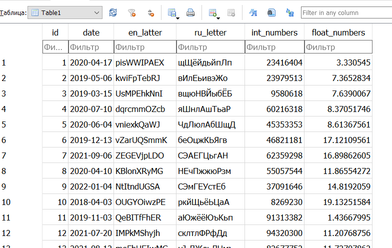


### 4. Сумма всех целых чисел, медиана всех дробных чисел.

Данное задание было реализовано двумя способами: с помощью создания функции для PostgreSQL,
 с помощью orm sqlalchemy. 

Скрипт sql находиться по пути "./task1/sql/test.sql".
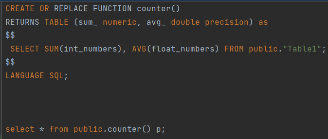


Для .py скрипта необходимо запустить функцию "task4", которая
находиться в файле "./task1/main.py"
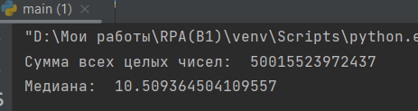


## Задание 2 (Django)
### Описание
Основная логика приложения реализована в файлах: "./B1_WEB/excel_app/db_repository/get_excel.py", 
"./B1_WEB/excel_app/db_repository/set_excel.py", "./B1_WEB/excel_app/views.py".

БД для хранения данных: SQLite. Модели для работы с 
бд описаны в файле "./B1_WEB/excel_app/models.py". Общение с бд происходит с помощью встроенной в 
Django ORM. Визуальная составляющая приложения в папке templates.

Чтение файла Excel и обработка данных происходит с помощью написанного класса Excel и библиотеки pandas
для удобства работы с данными. Запись из бд в xls файл происходит через класс DBExcel.

Схема бд SQLite:
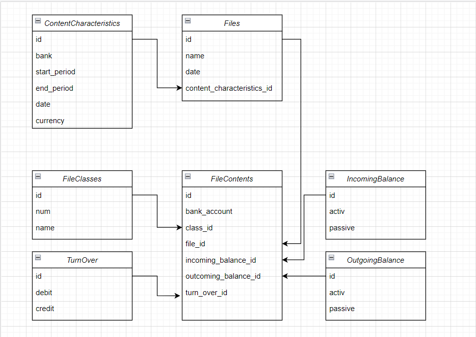

Скрины работы приложения:
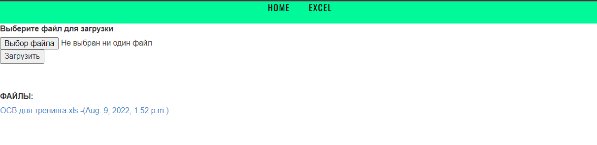
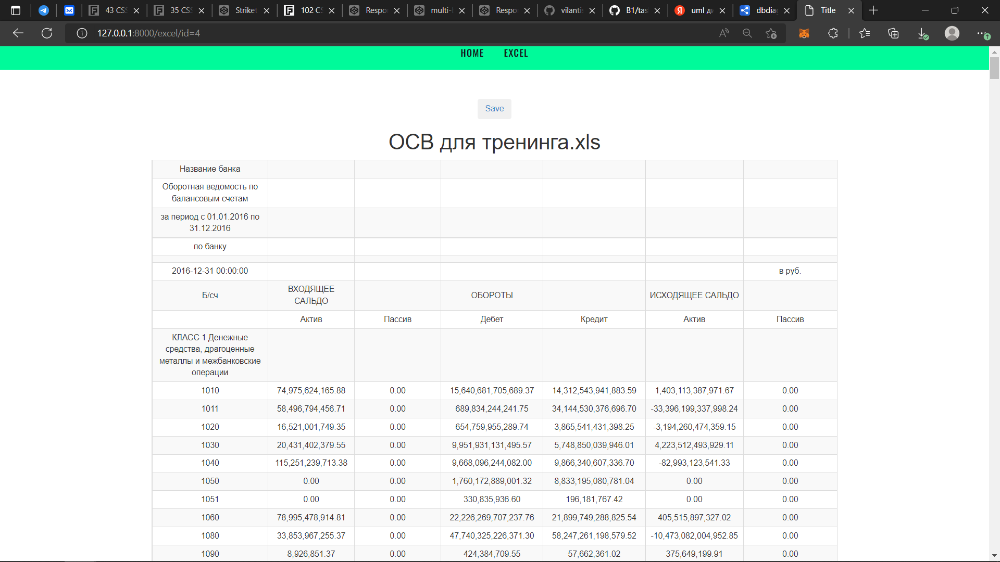
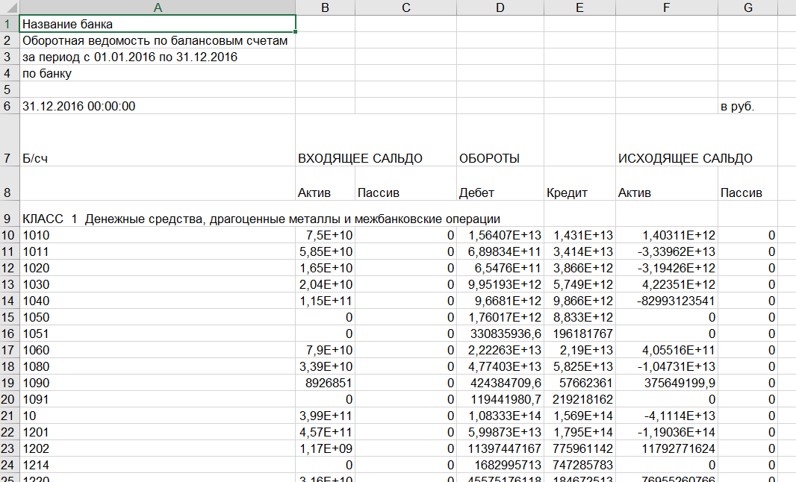

## Инструкция по настройке проекта:
Самый удобный для запуска проекта - PyCharm. Можно запустить на ОС Windows или Linux.

1. Клонировать проект
2. Открыть проект в PyCharm с наcтройками по умолчанию
3. Создать виртуальное окружение (через settings -> project "B1" -> project interpreter)
4. Открыть терминал в PyCharm, проверить, что виртуальное окружение активировано.
5. Обновить pip:
   ```bash
   pip install --upgrade pip
   ```
6. Установить в виртуальное окружение необходимые пакеты: 
   ```bash
   pip install -r requirements.txt
   ```

7. Синхронизировать структуру базы данных с моделями: 
   ```bash
   python manage.py migrate
   ```

8. Создать суперпользователя
   ```bash
   python manage.py shell -c "from django.contrib.auth import get_user_model; get_user_model().objects.create_superuser('kolya', 'abc@123.net', '123')"
   ```

9. Создать конфигурацию запуска в PyCharm (файл `manage.py`, опция `runserver`)

